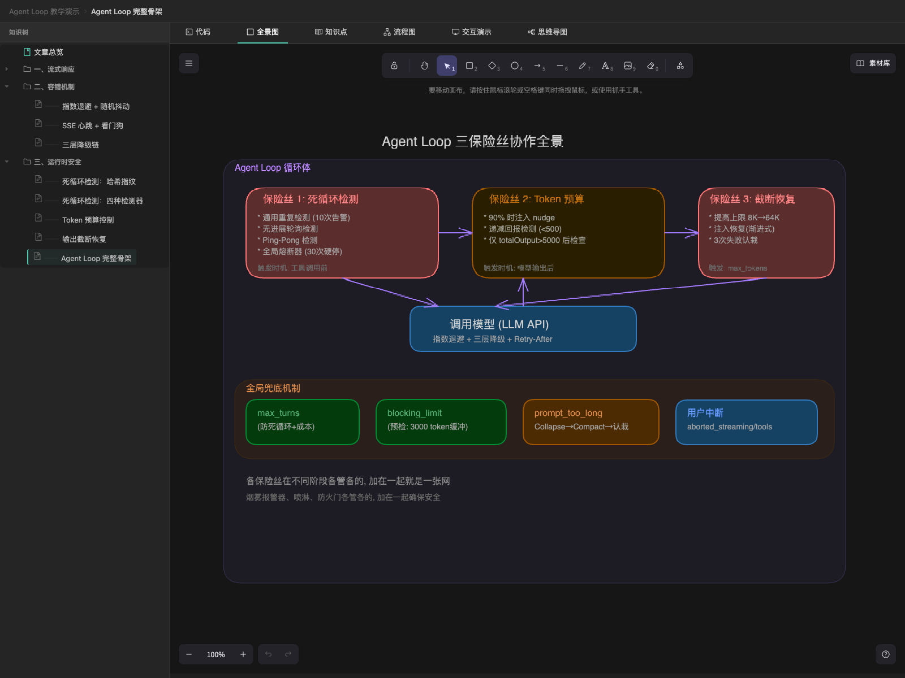
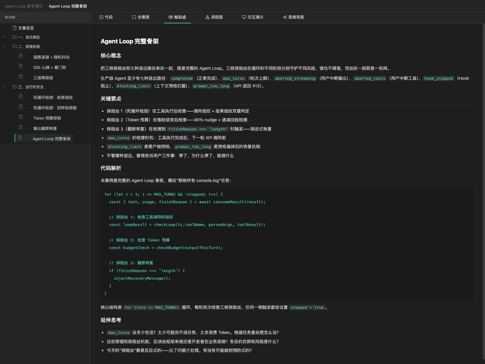
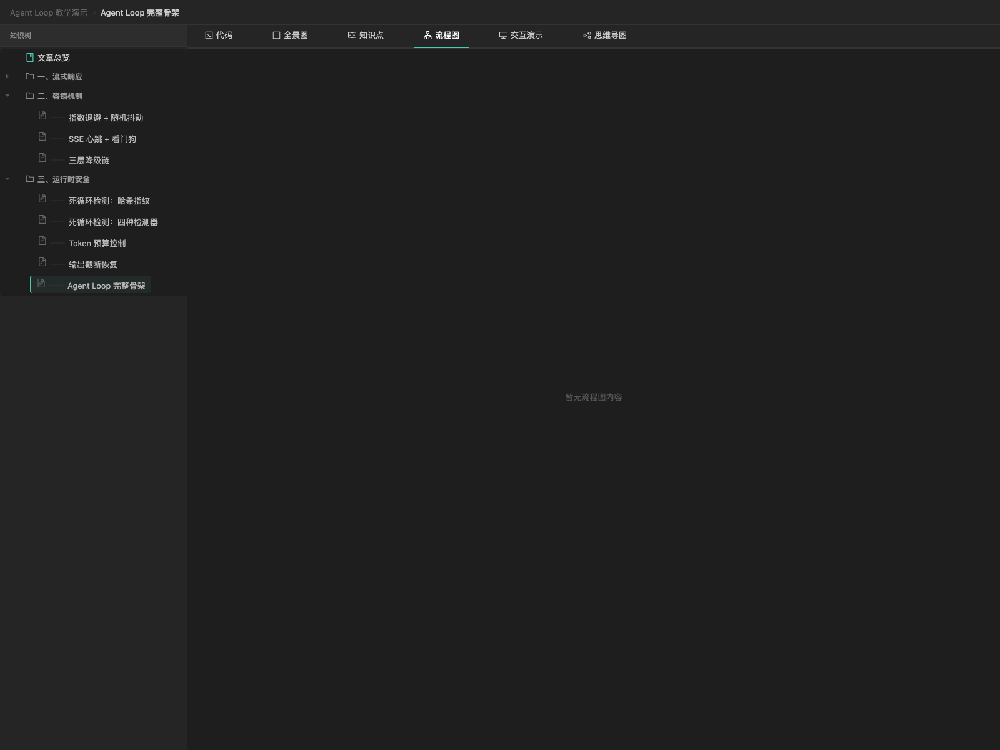
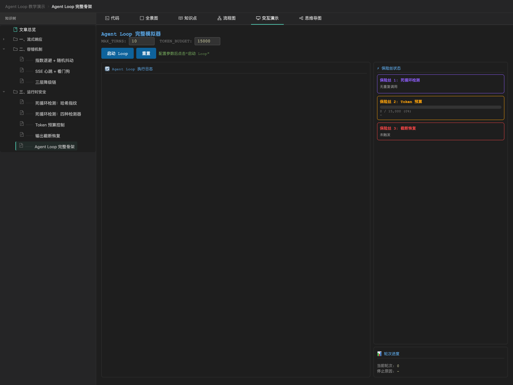
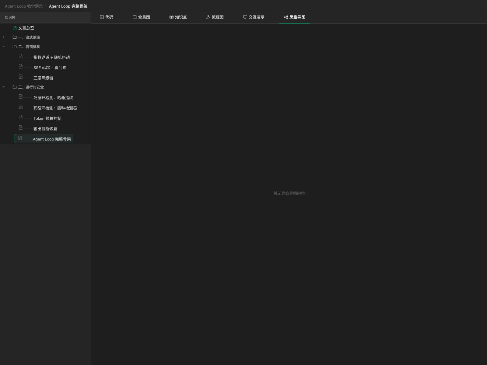
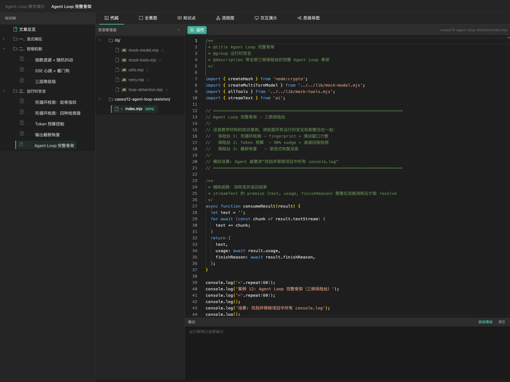

# agent-skills

A collection of agent skills for OpenCode, Claude Code, and other AI coding agents.

## Skills

| Skill                          | Description                                        | Install                                                       |
| ------------------------------ | -------------------------------------------------- | ------------------------------------------------------------- |
| [**commit**](./skills/commit/) | Git 提交与推送自动化：风格检测、原子拆分、冲突处理 | `npx skills add caosiwei97/agent-skills --path skills/commit` |
| [**teaching-viz**](./skills/teaching-viz/) | Markdown 教学内容可视化：扫描目录、生成思维导图/Mermaid 流程图、启动交互式教学页面 | `npx skills add caosiwei97/agent-skills --path skills/teaching-viz` |

## Install

```bash
# Install a specific skill
npx skills add caosiwei97/agent-skills --path skills/<skill-name>

# List all available skills
npx skills add caosiwei97/agent-skills --list
```

## Showcase: teaching-viz

Provide a directory of Markdown teaching content, and teaching-viz generates an interactive visualization page with multiple tabs:

### Overview — Knowledge Tree


### Excalidraw Canvas (全景图)



### Knowledge Article (知识点)



### Mermaid Flowchart (流程图)



### Interactive Demo (交互演示)



### Mindmap (思维导图)



### Code Examples (代码)



## License

MIT
